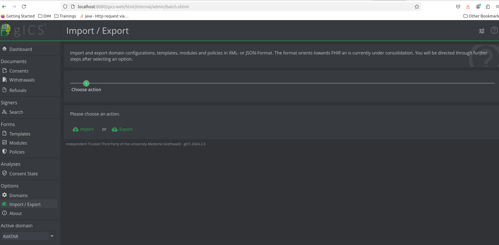
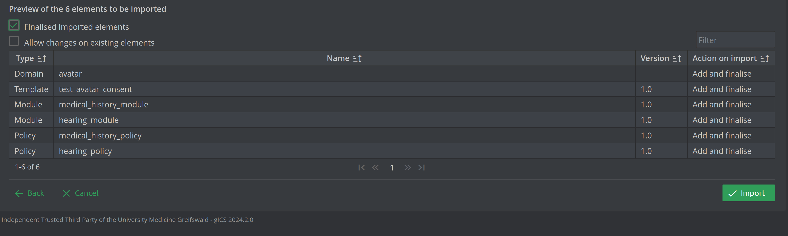

# gICS Data 

The file `2024-12-02 AVATAR COMPLETE.json` contains the gICS data that needs to be imported when launching the gICS container.

In particular, it contains the definition of:

+ The *AVATAR* domain (key `avatar`);
+ Two policy definitions associated which the AVATAR domain
  + `hearing_policy`
  + `medical_history_policy`
+ Two module definitions associated with the AVATAR domain
  + `hearing_module` (to which the `hearing_policy` corresponds)
  + `medical_history_module` (to which the `medical_history_policy` corresponds)
+ One consent template form, associated with the AVATAR domain and than contains the two modules (key `test_avatar_consent`)

To import the file, simply launch the gICS application through `docker-compose` (it can be downloaded [here](https://www.ths-greifswald.de/en/researchers-general-public/gics/)).

The UI is then available under `http://localhost:8080/gics-web`

Once in the UI, click on the `Import/Export` button and then select the `json` file to import.

After selecting the `json` file you should see something like this:

Remember to check the `Finalised imported elements` checkbox and then click `Import`

Now you have everything you need to start the avatar app and create some fake patients and some fake contents in the gICS system.

